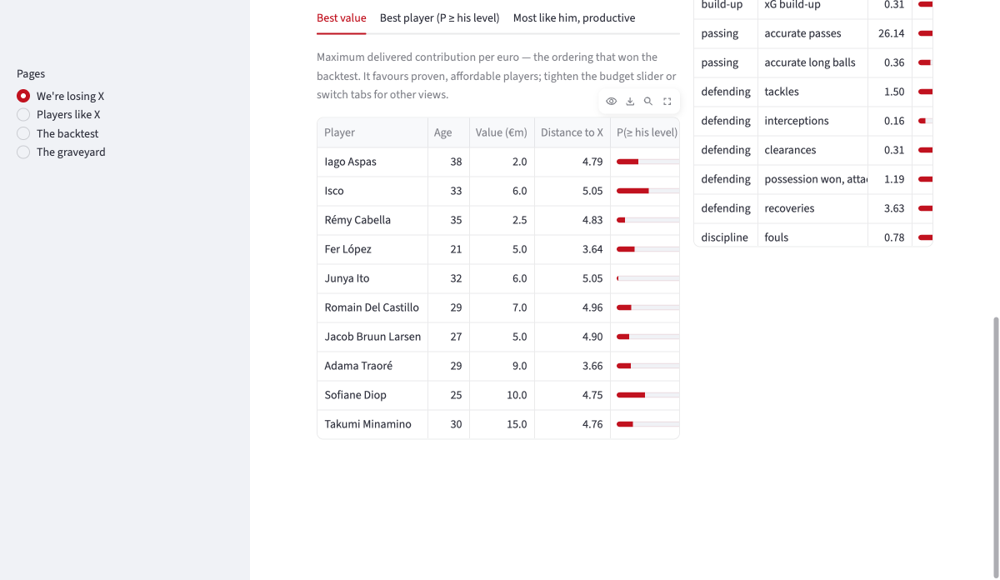
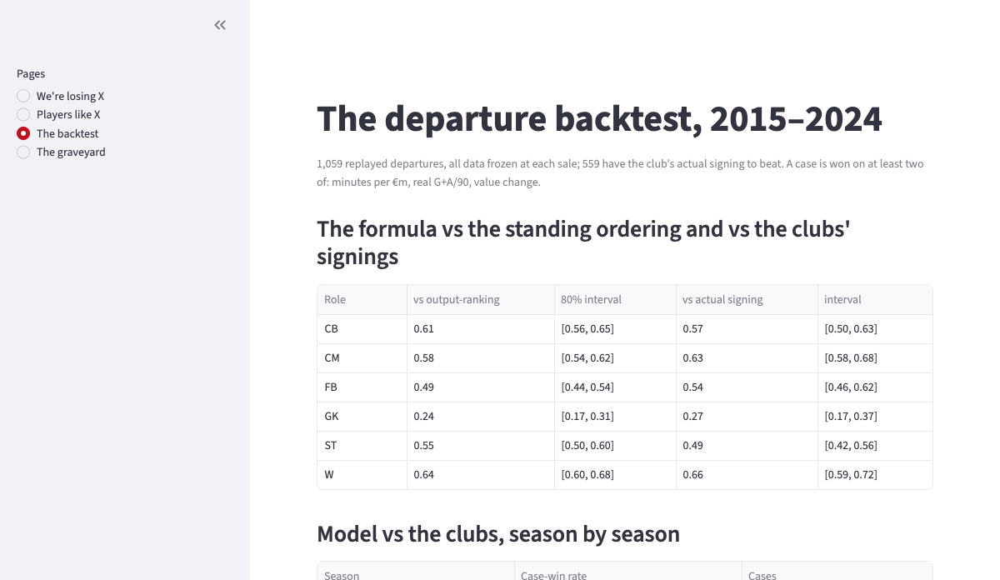

# Moneyball replacement scouting

A smaller Big-5 club is selling a player and needs a replacement. It wants the same contribution
for far less than the market charges. This project answers that question with a system built on
12 seasons of data from 13 leagues, then tests the system by replaying ten years of real
departures and checking whether its shortlists would have beaten the players the clubs actually
bought.

## See it in one minute

The app is live at https://football-player-scouting.streamlit.app/ and needs no install. It
also runs from a fresh clone with no data pulls. Every number it shows is read from committed
result files:

```bash
uv sync && make app
```



## The result

1,059 real summer departures from Big-5 clubs, 2015 to 2024, replayed with all data frozen at
each sale. Each shortlist is judged on three outcomes the system does not produce itself:
minutes actually played per million euros, real goals+assists per 90, and market-value change.
All three are measured per euro spent. A case is won by taking at least two of the three.

| Shortlist ranked by the final formula | beats the standing xG-ranking | beats the club's actual signing |
|---|---|---|
| Wingers | **0.64** | **0.66** |
| Central midfielders | **0.58** | **0.63** |
| Centre-backs | **0.61** | **0.57** |
| Full-backs | 0.49 | 0.54 |
| Strikers | 0.55 | 0.49 |
| Goalkeepers | 0.24 (exempt, see below) | 0.27 |

Against the market's own logic, meaning "buy the most expensive player you can afford", the
system wins **0.72 [0.70, 0.75]** of cases pooled over smaller-club sellers. Against
professional scouting departments it reaches parity or better in six of ten seasons (2021 was
its worst year at 0.27). Its picks play more and produce more per euro. Real clubs are better at
buying young players who appreciate. 559 of the cases have an identifiable actual signing to
beat. A single confirmation run on the held-out 2025-26 season, described below, repeated the
verdict at 0.63 against the clubs' signings pooled over the outfield positions.



## How the replay works

The test covers every player a Big-5 club sold in a summer window since 2015 who had a real
statistical season at that club, meaning at least 600 league minutes in a position the year
before. Without one there is nothing to replace. For each of those departures:

1. **Freeze the data.** Profiles, form, prices and expected minutes are all rebuilt from seasons
   strictly before that summer. This is enforced in code: every data builder takes an `as_of`
   date and raises an error if asked for anything later, and a test checks that it does.
2. **Build the shortlist.** The system searches exactly as it would today. Candidates must play
   the same position, resemble the departing player, and cost no more than the fee the club
   received. It takes its top five.
3. **Unfreeze and score.** For every shortlisted player, and for the club's real signing, the
   following season is read off: minutes actually played, real goals+assists per 90, and the
   change in market value. Actual goals and assists are used rather than xG so that the system
   is not scored on the statistic it ranks with.
4. **Compare.** There are three opponents. The club's **actual same-position signing** at its
   real fee, which is a professional scouting department with local knowledge. A **naive rule**
   that ranks the same pool by last season's goals+assists. And the **market's logic**, which
   takes the most expensive affordable candidate first.

Two facts about the population are stated rather than hidden. Clubs relegated by the sale summer
are excluded, because they are no longer running a Big-5 replacement search. And about 43% of
real departures, mostly youth players and loanees, have no statistical season at the selling
club and cannot be replayed at all.

One case in full. In summer 2019 Leicester sold Harry Maguire to Manchester United for 87m
euros. Frozen at that date, the best-player list for Leicester's budget is led by Willy Boly at
12m euros and Fabian Schär at 8m. The following season Boly played 1,980 league minutes and
Schär 1,672 with 0.11 goals+assists per 90, most of a starter's season for a tenth of the fee.
The 2023 most-like-him list for replacing Declan Rice is led by Mateo Kovacic at 38m, then
Mathias Jensen and Ivan Ilić, midfielders with Rice's profile rather than the top of a goals
table. West Ham's actual replacement, Edson Álvarez at a 38m fee, played 2,383 minutes at 0.07
goals+assists per 90; Jensen delivered 2,221 at 0.24 for a 22m valuation. All 1,059 cases can
be browsed in the app with their shortlists and the club's actual signing side by side.

## How the system works

There are three stages, in the order a sporting director works.

### 1. The filter: who is a plausible candidate

Positions come from where players actually stood, match by match, grouped into six roles:
goalkeeper, centre-back, full-back, central or defensive midfielder, winger or attacking
midfielder, and striker. This grouping was chosen because it is the only one where players keep
their role from season to season 90% of the time and every role still has enough players to
model. Attacking midfielders sit with the wingers because their numbers match wingers rather
than central midfielders.

Inside the position, candidates must resemble the departing player. They are the nearest
neighbours across fifteen traits: chance quality, chance creation, shot volume, build-up
involvement, where a player shoots from, and how his minutes split across positions. Each trait
had to pass two tests to be included. A player's number this season must predict his own number
next season, and the number must survive a move to a new club. Traits that failed, such as goals
and assists themselves, errors leading to shots, and possession-adjusted volumes, measure luck or
team context and were dropped.

These fifteen traits are attacking and build-up measures. Defensive actions and duel win rates
are shown on every player card, and they passed the same two tests, but they are not part of the
distance that picks the shortlist. That is a real limitation and it is listed below.

The filter excludes candidates rather than scoring them, and that distinction mattered. Mixing
similarity into the ranking made the ranking worse. Using similarity to decide who is comparable
at all, and then ranking inside that group, worked. If a club loses a destroyer, the list is
full of destroyers.

### 2. The ranking: who delivers most per euro

Outfield candidates are ordered by one number:

> **(quality above a freely available player) x expected minutes / price**

This is expected surplus production per euro. It is the objective the project's design document
stated before any data was touched. Each part of it was tested separately.

- **Quality** is npxG+xA per 90, smoothed over three seasons with recent seasons weighted more,
  and shrunk toward the role average in proportion to how little is known about the player. This
  statistic was chosen by a specific test. Since the product is buying a player from another
  club, each candidate measure was computed from a player's old club and checked against what he
  actually did at his new club. Raw npxG+xA predicted best, with r 0.447 for attacking roles and
  0.561 for the rest. Team-adjusted shares, plus-minus and actual goals+assists all did worse.
- **The replacement level**, meaning "freely available", is the 20th percentile of regulars in
  that role and season. It is the quality a club can sign for almost nothing.
- **Expected minutes** come from a model of next season's minutes based on the last three
  seasons, age and role. It beats "same as last year" by 7% (746 vs 803 minutes of average
  error). A complete injury history of 23,837 players improved it by less than one minute, so
  injuries are not used.
- **Uncertainty is measured.** Every projection carries an interval calibrated on future seasons
  the fitting never saw. Claimed 80% intervals contain the truth between 0.79 and 0.81 of the
  time. The replay's probabilities, shown as "P >= his level" in the backtest browser, have a
  mean reliability gap of 0.046, so when the system says 70% the event happens close to 70% of
  the time. The demo page asks the harder question, the probability of matching the departing
  player's season production, built on the same intervals with the minutes forecast treated as
  known.

Goalkeepers are an exception and this is reported rather than hidden. Their contribution is
on-target xG faced minus goals conceded per 90, which is negative for every keeper because
pre-shot xG runs below goals, so only the ranking between keepers carries meaning. The formula
fails for them at 0.24, because their surplus rests on a noisier estimate and keepers produce
no goals or assists for two of the three scoring columns. Keepers are ranked on goals prevented
against an average keeper facing the same shots.

### 3. The price: what the market would say

A gradient-boosting model prices any player from stats, age, minutes, club strength and his
previous value. It is constrained so that value can never fall when performance or club level
rises. Its held-out error is 0.185 in log-value terms, which is a typical miss 24% of a player's
value against 33% for a naive rule. Run through the ageing curves it produces resale estimates
whose 80% bands were checked at 0.82 / 0.81 / 0.81 coverage at one, two and three years out.

Cross-league moves use a measured exchange rate rather than an assumption. It comes from the
output of 718 real movers before and after their transfers:

| Move | Output kept |
|---|---|
| Feeder league to Big 5 | **0.67** |
| Big 5 to Big 5 | 0.85 |
| Big 5 to feeder league | 1.21 |
| Feeder to feeder | 0.91 |

Movers going from a feeder league to the Big 5 keep 67% [63%, 71%] of their output. Even Big-5
to Big-5 movers show 0.85, which is mostly regression to the mean and applies to every move.

## How the ranking rule was chosen

The most contested question in the project was how a defender's shortlist should be sorted: by
similarity, by defending stats, by coach trust, by a rating, or by output. It was settled by
testing rather than by argument. Nineteen orderings were graded on the same replayed decade,
each building shortlists for the same cases and scored on the same three outcomes.

- **Similarity first** lost to output within the filter, at 0.42, 0.39 and 0.39 for centre-backs,
  full-backs and central midfielders.
- A **similarity and output blend** beat similarity first at 0.52, 0.58 and 0.50, and reached
  parity with real clubs at centre-back and central midfield. It was the best
  similarity-respecting rule found, but it stayed under 0.5 against output everywhere.
- **Duel quality stats**, meaning win rates, times dribbled past and ball retention, are real
  traits that repeat at r 0.36 to 0.74 and survive transfers. Sorting by them still lost to
  everything except the market. They describe players well and rank them badly.
- **Coach trust**, meaning expected minutes, lost overall, but it is the only ordering that beats
  output on the value-growth column, winning 66% to 69% of midfield cases. The players coaches
  keep picking appreciate best. They also cost more, which is why it loses on the other columns.
- **Sofascore's own rating** answers the question "why not just sort by rating". It is the best
  single-number challenger at 0.43 to 0.48 and still loses.
- Ageing-forward projections, floor and ceiling sorts, week-to-week consistency, and a consensus
  of all orderings all lost.
- The **production per euro formula** beat output itself in every outfield role.

One caveat about the winner. The formula was graded after the main tournament, so it did not
face the same fresh test the earlier candidates did. It is the design document's own pre-data
objective rather than a rule shaped to fit the table. The 2025-26 season, untouched by every
decision above, was spent on a single pre-registered confirmation run, described next.

## The confirmation test

Every ordering above was graded on the same replayed decade, so the winner needed a season no
decision had touched. The 2025-26 season finished after the design was frozen and was spent
exactly once: the same frozen protocol replayed all 196 paid summer-2025 departures,
shortlists built only from data available at each sale, then graded on what actually happened
in 2025-26.

The formula passed. Pooled over the outfield positions it beat the clubs' actual signings in
0.63 [0.57, 0.68] of 119 cases, better than its decade average, and it finished above even in
every outfield position: 0.68 at central midfield, 0.67 at winger, 0.63 at centre-back, 0.61
at full-back and 0.53 at striker. One summer gives 19 to 36 cases per position, so only the
midfield and winger intervals clear even on their own; the pooled interval does clearly.
Against the market ordering it won 0.75 of cases, and against the naive goals+assists rule
0.68. The signature matched the decade exactly: big wins on minutes per euro and on real
goals+assists, a loss on value growth. Goalkeepers failed again at 0.22 of nine cases; that
weak spot is real and stays reported. The two kept alternatives were scored on the same cases
for context and finished behind, output at 0.51 and the blend at 0.55 against the clubs, so
the pass belongs to the formula, not to the pool it picks from.

## Defence, measured honestly

The backtest now carries a fourth outcome next to the three graded columns: the duel quality
the shortlisted players actually delivered the following season (ground and aerial duels won,
standardised within position and season), compared with the club's real signing. It is reported
separately and never folded into the win/loss verdict, so the tournament above stays comparable.

The answer is uncomfortable and published anyway. The system signs worse duellists than real
clubs at every position except striker: at centre-back its picks delivered +0.15 against the
clubs' +0.18, at full-back -0.07 against +0.14, and only at striker did it win, +0.27 against
+0.19. Two remedies were tested. Putting defensive traits into the similarity filter made
results worse in five of six positions, because matching defensive style reproduces the
departing player's defending, weaknesses included. Putting an explicit weight on defensive
quality in the ranking worked: at a weight of 0.25 the shortlists' delivered duel quality rises
to 0.26 at centre-back and 0.35 at central midfield, beating the clubs, for one to three
percent of expected production. The cost is real, though: such shortlists are dearer, so they
lose head-to-head on the per-euro columns that carry nine years of validation. The weight is
therefore a control in the app, default zero, with this trade-off shown beside it.

## Ideas that failed their tests

Every component had a kill check written before it was built. The failures are reported, and
several are the most useful findings in the project.

- **Finishing skill.** Scoring above your xG does not persist, with year-to-year r 0.02 to 0.09.
- **Defensive value from outcomes.** A player's effect on goals conceded does not repeat, with
  on/off r between -0.03 and +0.08 across 17,327 player-seasons. Defensive actions do travel
  with the player at r 0.47 to 0.64, so they shape the filter instead. Five designs were tried.
  Season-length samples are not enough to credit an individual defender for goals prevented.
- **Big-game players.** The average effect of opponent strength is real, with strikers losing
  about 0.06 xG+xA per 90 per 100 Elo points of opponent. An individual's sensitivity is noise
  at r 0.01 to 0.10, and adjusting for it changed predictions by 0.000.
- **Style fit.** Moving to a stylistically different club costs nothing measurable, at +0.009 sd
  across 2,604 matched transfers. It is shown as context in the app and never moves a ranking.
- **Persistent price gaps.** Underpriced players do not stay underpriced, at r 0.05, and no club
  is a systematically cheap seller. The market's real inefficiencies are structural, in league
  and age premiums.
- **Injury history.** It adds under a minute of accuracy to minutes forecasts once past minutes
  are known.
- **Profile-weighted composite scores.** No future outcome, whether production, minutes or
  price, pays weights for tackles or passing on top of the core signal.
- **Errors leading to shots.** This is a luck statistic at r 0.12. An error-prone defender one
  season is not error-prone the next.
- **Possession-adjusted defensive volumes.** The standard correction for "bad teams defend more"
  makes the stats travel worse, with centre-back tackles dropping from 0.47 to 0.40. Raw per-90
  numbers are used instead.

## Data and identity matching

Six sources are used, none of which share identifiers. **Understat** provides shot-level xG and
per-match positions. Two quirks had to be handled: penalties are unlabelled and appear at xG
0.7612, and the season table credits all of a January mover's minutes to his last club.
**Sofascore** and **FotMob** provide work-rate and duel stats, and turned out to be the same
underlying feed for 16 metrics, which are merged into one column each. A public **Transfermarkt**
database provides values, transfers and appearances, and its **injury pages** provide 116,562
spells. **ClubElo** provides club strength.

Matching identities was the hardest part. For players, a public id-register is used first, then
fuzzy name matching with a hand-validated threshold. Fuzzy matching is banned for one-word names
after an audit found that 27 of 75 such joins were different Brazilian players sharing a
nickname. The result bridges 99.8% of Big-5 minutes, with the worst league-season 98.9%. For
clubs, 700 provider spellings are mapped to canonical clubs, with ties broken on the data rather
than on database row order. That rule came from a real bug: "Verona" matched two clubs with
identical scores and the winner changed between runs. The finished panel reconciles with
official appearance logs within 5% for 96.7% of 1,170 club-seasons. Raw data is never committed.
The loaders are public and every pull is cached and resumable.

## Reproducibility

```bash
uv sync                 # exact environment from uv.lock
make data               # fetch (resumable), build the panel, write the data report
make train              # regenerate every artifact in models/, byte-identical across runs
make test               # the full suite: leakage guard, README number-checker, model pins
make app                # the Streamlit app, reading committed artifacts only
```

The code cannot read future data. Every builder takes an `as_of` date and raises an error on any
request past it, and tests enforce this. Training is deterministic, and this was verified rather
than assumed. A full regeneration audit found the boosting model varying across thread
schedules, and a tie-break that depended on database row order. Both were fixed, and the
backtest and market stages now produce byte-identical output on repeated runs. The app displays
only what the committed artifacts contain, so it cannot disagree with this document. A test
suite pins every number quoted here to those artifacts and fails if they drift.

## Limitations

Two of the three scoring columns are measured per euro, so cheap players are structurally
favoured. The shortlists the formula produces have a median price of €1.8m against a median
actual signing fee of €10m. Buying production cheaply is the stated objective, but it means the
test rewards frugality as well as quality, and a club replacing a first-choice player should use
the budget filter in the app to see options at its own price level.

Candidate pools are Big-5 only. The feeder-league tier lacks per-match positions and profiles,
so it is a documented extension rather than a silent gap. About 43% of real departures, mostly
youth players and loanees, have no statistical season at the selling club and cannot be
replayed. Real clubs beat the system on the value-growth column, because the system does not
chase appreciation.

Defending is the weakest part of the system. Five designs for measuring defensive value from
outcomes all failed, so the ranked number contains no defending, and the similarity filter is
built from attacking and build-up traits only, because adding defensive traits to it was tested
and made shortlists worse. What defence the system can see is described in the section above:
a measured duel-quality gap against real clubs, and an optional ranking weight that closes it
at a known price. Finally, the ranking tournament reused one decade many times. The
one permitted run on the held-out 2025-26 season confirmed the formula, and seasons from
2026-27 onward remain untouched.

## The repository

```
notebooks/   five numbered notebooks, kept with outputs, holding the full analysis:
             01 data exploration, 02 contribution, 03 market, ageing and minutes,
             04 fit and similarity, 05 the departure backtest
src/scout/   the installable package the notebooks import from:
             data fetchers, panel builders, models, the backtest, train stages
models/      committed artifacts, every trained result and verdict as JSON.
             The app and this README read only from here
app/         the Streamlit app, four pages, artifacts only
tests/       the suite: leakage guard, model pins, the README number-checker
```
